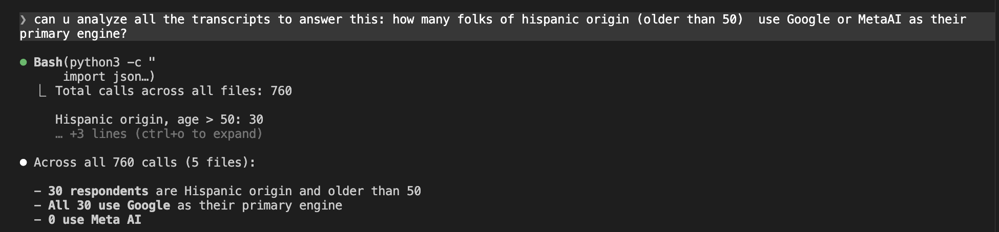
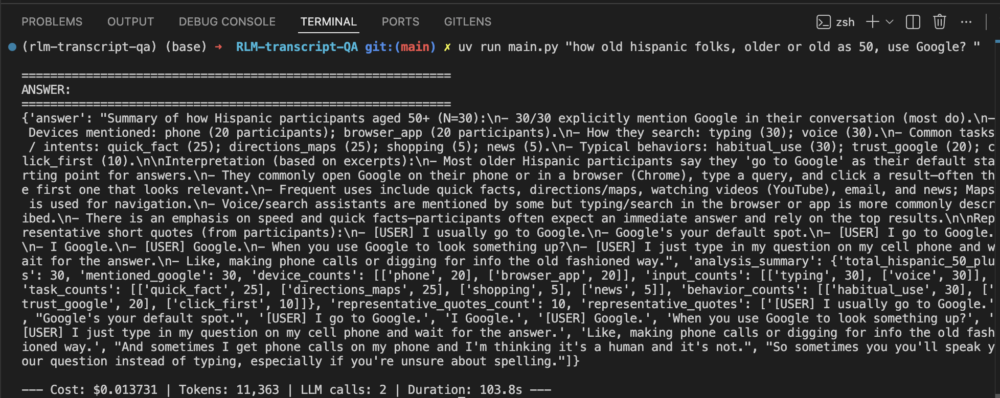

# RLM Transcript QA

Ask natural language questions over hundreds of interview transcripts using [DSPy's Reasoning Language Model (RLM)](https://dspy.ai).

## The Problem

We have 600+ interview transcripts (~1M+ tokens) from AI-moderated research calls about search engine and AI tool usage. The data is too large to fit in any single LLM context window. We need a way to ask complex analytical questions across the entire dataset.

## How It Works

**RLM (Reasoning Language Model)** solves this by combining an LLM with a code interpreter in an iterative loop:

1. The **main LM** (Gemini 3 Flash) reasons about the question and writes Python code to analyze the data
2. The code executes in a **sandboxed Deno/Pyodide interpreter** with access to the full transcript text
3. Within that code, `llm_query()` and `llm_query_batched()` call a **sub LM** (GPT-4o-mini) for semantic analysis tasks like topic extraction or sentiment classification
4. The main LM reviews the code output and decides whether to write more code or submit a final answer
5. This loop repeats (up to 100 iterations) until the answer is ready

This approach lets the system process arbitrarily large datasets — the LLM never needs to "read" all the data at once. Instead, it writes code to iterate over it programmatically and delegates focused semantic queries to the cheaper sub LM.

## Transcript Format

Transcripts are stored as JSON arrays in `data/`. Each file contains an array of call objects:

```json
{
  "id": "cmfizraj9040ine215oacg3es",
  "responseId": "cmfizqoa70409ne21pge28qln",
  "messages": [
    {
      "callId": "cmfizraj9040ine215oacg3es",
      "index": 0,
      "role": "bot",
      "time": "2025-09-14T01:03:18.707000Z",
      "message": "Hi there. I'm Elliot, your AI moderator..."
    },
    {
      "role": "user",
      "message": "Usually, I go to Google."
    }
  ],
  "attributes": [
    { "label": "Gender+", "value": "Female" },
    { "label": "Age", "value": "35" },
    { "label": "Ethnicity", "value": "White" },
    { "label": "US Census Region", "value": "South" }
  ]
}
```

- **messages**: The conversation between the AI moderator (`bot`) and the participant (`user`), ordered by `index`
- **attributes**: Demographic metadata about the participant (age, gender, region, income, etc.)

At load time, all JSON files in `data/` are merged and reformatted into a flat text block for RLM to process via code.

## Models

| Role | Model | Purpose |
|------|-------|---------|
| Main LM | `gemini/gemini-3-flash-preview` | Reasoning, code generation, and orchestration |
| Sub LM | `openai/gpt-4o-mini` | Semantic analysis via `llm_query()` / `llm_query_batched()` inside RLM code |

The main LM handles the "thinking" — deciding what code to write and when to submit. The sub LM handles bulk semantic work like classifying or summarizing individual transcripts, keeping costs low.

## Setup

### Prerequisites

- Python 3.13+
- [uv](https://docs.astral.sh/uv/) package manager
- [Deno](https://deno.com/) runtime (for the sandboxed code interpreter)

### Environment Variables

Create a `.env` file in the project root:

```
GOOGLE_API_KEY=your-google-api-key
OPENAI_API_KEY=your-openai-api-key
```

### Install & Run

```bash
uv sync
uv run main.py "What are the most common topics discussed in these calls?"
```

### Example Output

```
ANSWER:
1. Search engine habits and preferences (primarily Google)
2. Comparison of traditional search vs. AI tools (ChatGPT, Gemini, Perplexity)
3. Trust and information verification
4. Specific use cases for AI (brainstorming, writing, recipes, travel)
5. User experience and interface preferences

--- Cost: $0.063424 | Tokens: 243,429 | LLM calls: 189 (main: 6, sub: 183) | Duration: 100.3s ---
```

## Screenshots

### Analyzing transcripts with Claude Code

Claude Code running a demographic query across 760 calls — filtering Hispanic respondents over 50 and their primary search engine.



### Direct RLM run with GPT-5 Mini

Running `main.py` directly from the terminal. The RLM processes all transcripts autonomously and returns a structured summary.


